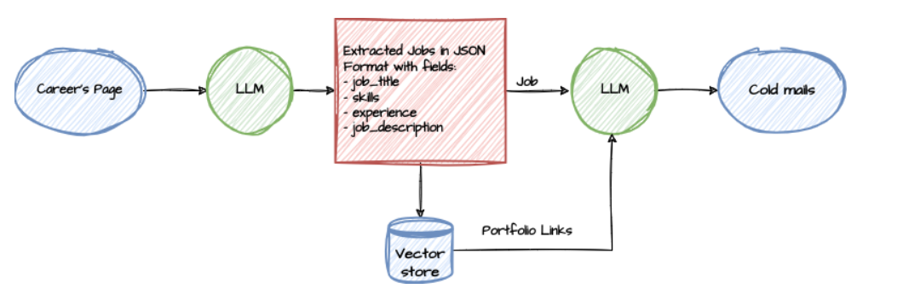

# 📧 Cold Mail Generator

A powerful cold email generator for service companies using **Groq**, **LangChain**, and **Streamlit**.  
This tool helps you craft **personalized cold emails** by extracting job listings from a company's careers page and matching them with relevant portfolio links from a **vector database**. ✨

---

## 🌟 Key Features

- 🔗 **URL Input**: Paste a company's careers page URL to get started.
- 📝 **Job Extraction**: Automatically extracts job listings from the careers page.
- 📩 **Personalized Email Generation**: Creates tailored cold emails based on extracted job descriptions.
- 🎨 **Portfolio Matching**: Suggests relevant portfolio links from a vector database aligned with the job role.
- ⚡ **Fast & Efficient**: Powered by Groq's lightning-fast LLM inference for rapid responses.

---

## 🏗️ Architecture Diagram



---

## 🚀 Getting Started

### 1. 🔧 Prerequisites
- Python 3.7+
- Groq API Key (Get yours [here](https://console.groq.com/keys))

---

### 2. ⚙️ Setup

```bash
# Clone the repository
git clone github.com/SimranShaikh20/Cold-Email-Generator
cd Cold-Email-Generator

# Install the required dependencies
pip install -r requirements.txt
```

---

### 3. 🔑 Configuration

Create a `.env` file inside the `app/` directory and add your Groq API key:

```env
GROQ_API_KEY=your_api_key_here
```

---

### 4. ▶️ Running the Application

```bash
streamlit run app/main.py
```

The application will open in your default browser at `http://localhost:8501/`.

---

## 🖥️ User Interface

Application Screenshot:


---

## 📋 Usage Guide

### For Open Positions:
- Paste the company's careers page URL.
- The tool will **extract the job listings**.
- It will **generate personalized emails** with matching portfolio links.

### For Cold Outreach (No Specific Openings):
- Use the tool to generate a **general introduction email**.
- Express your **interest in future opportunities**.
- Attach relevant portfolio examples to increase your chances.

---

## 🛠️ Technologies Used

- **Groq**: For ultra-fast large language model (LLM) inference.
- **LangChain**: To build chains that control the flow of data and logic.
- **Streamlit**: For creating an interactive and user-friendly web application.
- **Vector Database**: To store and retrieve portfolio links based on semantic matching.

---

## 📜 License

- Licensed under the **MIT License**.
- ⚠️ **Important**: Commercial use of this software is strictly prohibited without prior written permission from the author.
- **Attribution** must be given in all copies or substantial portions of the software.

---

© Copyright (C) Simran Shaikh. All rights reserved.

---
